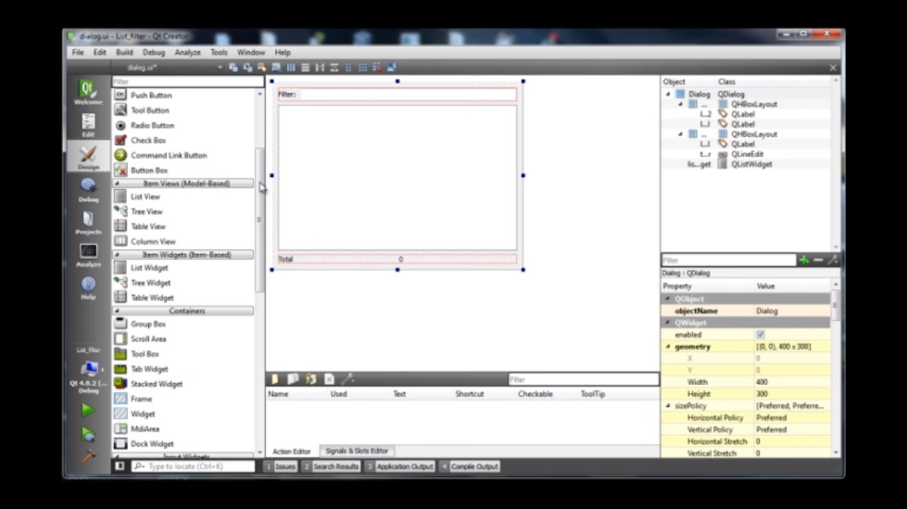

# Laurent_catalogo_lab_elo

Minha proposta para o trabalho de programação é um software com um sistema de busca 
simples para poder facilitar a procura pelos componentes no laboratório de eletrônica, 
ou seja, o usuário começa digitando as letras do nome do componente que ele quer 
e um motor de busca vai mostrando quais são as peças que têm lá no Lab e que começam 
com aquelas letras. Conforme ele vai escrevendo a palavra as opções se reduzem. 
Quando ele clica no item que deseja aparecem algumas informações.

##Biblioteca

  A biblioteca utilizada foi QT seguindo o tutorial de vídeos do Youtube. Segue o link:
  https://www.youtube.com/watch?v=GxlB34Cn0zw&index=3&list=PL2D1942A4688E9D63
  
  
##Esboço

Sobre o programa:
O kit utilizado no QT foi o Desktop Qt 5.11.0 MinGW 32bit.
É necessário definir um diretório qualquer do computador para que o programa liste seus arquivos na linha 10 do dialog.cpp
Eu consegui fazer o motor de busca usando a biblioteca QRegExp e ainda tem um contador que mostra o total de resultados encontrados.O problema é que não consegui fazer o programa listar os componentes do laboratório que estariam em um arquivo excel ou um txt. O motor de busca apenas procura pelos arquivos os quais estão no diretório definido.
